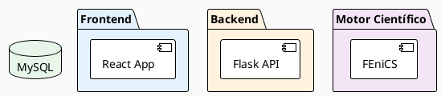
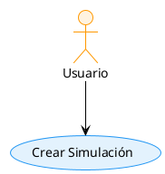
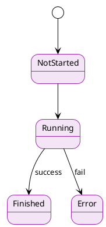

# 🎨 Guía de Paleta de Colores - Diagramas BDAT

## 📋 Archivos de Configuración

### 1. `colors_theme.puml` - Definiciones de colores
Constantes de colores reutilizables para todo el proyecto.

### 2. `style_config.puml` - Configuración de estilos
Configuración automática de estilos para todos los elementos.

---

## 🎯 Cómo Usar

### Opción 1: Importar configuración completa

```plantuml
@startuml Mi_Diagrama
!include style_config.puml

' Tu diagrama aquí...
@enduml
```

### Opción 2: Aplicar manualmente en cada diagrama

Agregar al inicio de cualquier `.puml`:

```plantuml
@startuml Mi_Diagrama
!theme plain
skinparam backgroundColor #FAFAFA

' Paquetes
skinparam package {
  BackgroundColor #E3F2FD
  BorderColor #2196F3
  FontColor #1565C0
  BorderThickness 2
}

' Componentes
skinparam component {
  BackgroundColor #FFFFFF
  BorderColor #2196F3
  BorderThickness 2
}

' Tu diagrama...
@enduml
```

---

## 🎨 Paleta de Colores

### Colores Principales (Material Design)

| Color | Hex | Uso |
|-------|-----|-----|
| **Primary Blue** | `#2196F3` | Frontend, componentes principales |
| **Primary Light** | `#64B5F6` | Hover, estados activos |
| **Primary Dark** | `#1976D2` | Bordes, énfasis |
| **Secondary Cyan** | `#00BCD4` | Elementos secundarios |
| **Accent Pink** | `#FF4081` | Llamadas de atención, errores |

### Colores por Capa

| Capa | Background | Border | Uso |
|------|------------|--------|-----|
| **Frontend** | `#E3F2FD` | `#2196F3` | React, UI components |
| **Backend** | `#FFF3E0` | `#FF9800` | Flask, API, Services |
| **Motor Científico** | `#F3E5F5` | `#9C27B0` | FEniCS, GMSH, Procesamiento |
| **Base de Datos** | `#E8F5E9` | `#4CAF50` | MySQL, Archivos |

### Colores de Estado

| Estado | Color | Hex |
|--------|-------|-----|
| **Success** ✅ | Verde | `#4CAF50` |
| **Warning** ⚠️ | Naranja | `#FF9800` |
| **Error** ❌ | Rojo | `#F44336` |
| **Info** ℹ️ | Azul | `#2196F3` |
| **Neutral** ⚪ | Gris | `#9E9E9E` |

---

## 📝 Ejemplos de Aplicación

### Ejemplo 1: Diagrama de Componentes



### Ejemplo 2: Casos de Uso



### Ejemplo 3: Estados



---

## 🔄 Actualizar Diagramas Existentes

### Para actualizar todos tus diagramas automáticamente:

1. **Agregar al inicio de cada archivo:**
   ```plantuml
   !include style_config.puml
   ```

2. **O aplicar colores manualmente:**
   - Reemplazar colores antiguos con los nuevos
   - Usar la paleta de la tabla arriba

### Script de actualización rápida (Bash):

```bash
cd docs/uml/plantuml

# Agregar include al inicio de cada archivo
for file in *.puml; do
    if ! grep -q "style_config.puml" "$file"; then
        sed -i '2i !include style_config.puml' "$file"
    fi
done
```

---

## 🎯 Configuración Recomendada por Tipo de Diagrama

### Casos de Uso
- Actores: `#FFF3E0` (naranja claro)
- Casos de uso: `#E3F2FD` (azul claro)
- Sistema: `#F5F5F5` (gris claro)

### Secuencia
- Actores: `#FFF3E0` (naranja)
- Participantes: `#E3F2FD` (azul)
- Lifelines: `#BBDEFB` (azul más oscuro)

### Estados
- Estados normales: `#F3E5F5` (morado claro)
- Estado inicial: `#4CAF50` (verde)
- Estado final: `#F44336` (rojo)

### Clases
- Header: `#2196F3` (azul)
- Body: `#FFFFFF` (blanco)
- Border: `#2196F3` (azul)

---

## 🖥️ Vista Previa de Colores

### Paleta Frontend (Azul)
```
████ #E3F2FD - Background claro
████ #BBDEFB - Background medio
████ #2196F3 - Bordes y texto
████ #1565C0 - Texto oscuro
```

### Paleta Backend (Naranja)
```
████ #FFF3E0 - Background claro
████ #FFE0B2 - Background medio
████ #FF9800 - Bordes y texto
████ #E65100 - Texto oscuro
```

### Paleta Motor Científico (Morado)
```
████ #F3E5F5 - Background claro
████ #E1BEE7 - Background medio
████ #9C27B0 - Bordes y texto
████ #6A1B9A - Texto oscuro
```

### Paleta Base de Datos (Verde)
```
████ #E8F5E9 - Background claro
████ #C8E6C9 - Background medio
████ #4CAF50 - Bordes y texto
████ #2E7D32 - Texto oscuro
```

---

## 💡 Tips de Diseño

1. **Contraste:** Usa colores oscuros para texto sobre fondos claros
2. **Consistencia:** Mantén los mismos colores para los mismos conceptos
3. **Jerarquía:** Colores más brillantes para elementos importantes
4. **Accesibilidad:** Evita combinaciones problemáticas (rojo/verde)
5. **Minimalismo:** No uses más de 4-5 colores por diagrama

---

## 📚 Referencias

- **Material Design:** https://material.io/design/color
- **PlantUML Colors:** https://plantuml.com/color
- **Accessibility:** https://webaim.org/resources/contrastchecker/

---

**Creado para:** Sistema BDAT v1.1.0  
**Última actualización:** Enero 2025
